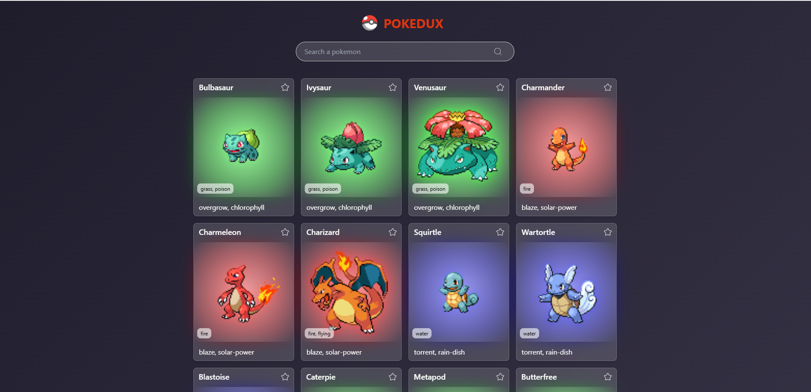

# Pokedux: Pokémon Explorer App

Pokedux is an application built with **React** and configured with **Vite** to explore the first 151 Pokémon from the first generation. This project aims to practice and reinforce advanced **Redux** concepts.

## Project Goals

- Learn and practice **Redux** fundamentals.
- Implement advanced patterns such as middlewares, **Redux Thunk**, and **Redux Toolkit**.
- Integrate immutability libraries like **Immutable.js**.
- Create a visually appealing and functional interface.

## Concepts Implemented

This project incorporates the following concepts and tools:

1. **Redux Fundamentals**: Centralized state and data management.
2. **Redux Lifecycle**: Understanding how data flows within Redux.
3. **Redux vs Context API**: Differences and when to use each.
4. **Custom Middlewares**: Creation and implementation of custom middlewares.
5. **Redux Thunk**: Middleware to handle asynchronous actions.
6. **Redux DevTools**: Advanced debugging for Redux.
7. **Redux Saga**: Handling side effects and complex flows.
8. **Immutability**: Using **Immutable.js** to ensure state immutability.
9. **Redux Toolkit**:
   - `createSlice`: Simplification of reducers and actions.
   - `createAsyncThunk`: Handling asynchronous actions with Redux Toolkit.
10. **Combined Reducers**: Modular organization of reducers.
11. **Integration with Connect and Hooks**: Using `connect` alongside `useSelector`/`useDispatch`.


## Technologies Used

- **React**: Library for building user interfaces.
- **Vite**: Development tool for a fast and lightweight environment.
- **Redux**: State management library for the application.
- **Redux Toolkit**: Simplified setup for Redux.
- **Immutable.js**: Ensuring immutability in the state.
- **Modern CSS**: Responsive and visually attractive design.

---


## App Previews

### Initial Screen



---

## Installation and Usage

1.  Clone this repository:

    ```bash
    git clone https://github.com/your-repo/to-do-list-app.git
    ```
2. Clone this repository:

    ```bash
    npm install
    ```

3. Start the development server:

    ```bash
    npm run dev
    ```
---

## Future Improvements

- Add search functionality for additional Pokémon generations.
- Improve animations and visual effects.
- Add support for saving favorites in localStorage.
- Implement unit tests for actions and reducers.

---

Explore Pokedux and discover your favorite Pokémon! 🚀